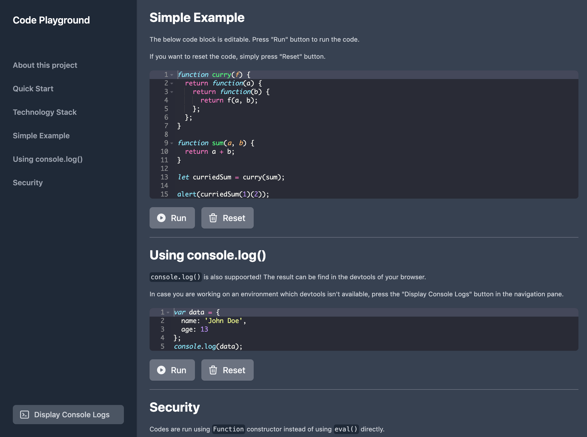

<p align="center">
    
</p>
<h1 align="center">Code Playground</h1>
<p align="center">
    A simple template for documenting your JavaScript library which provides a live-ediitable code playground for users to test and play around. 
</p>

## Background
A handy way to document how to use a JavaScript library, while you don't want to include any fancy build tools in your codebase. 

This projects is build in the simple way where the source code is ready to run in browser without compilation.

## Live Demo


You can try it out at:[https://icelam.github.io/code-playground](https://icelam.github.io/code-playground). 

Note: In case you hit a 404 not found issue, it might be issue of service worker not up-to-date. Try to hard refresh the page, or visit the page using private window.

## Features
1. Editable and runnable code example, where code example is run using a semi-sandbox environment using `Function` constructor
2. Console Output on screen for environment where devtools is not available

## Technology
* CSS Framework: [Tailwind CSS](https://tailwindcss.com/)
* JavaScript Framework: [Apline.js](https://github.com/alpinejs/alpine)

## Browser Compatibility
* Tested on Legacy Microsoft Edge (Microsoft Edge 44.17763.831.0, Microsoft EdgeHTML 18.17763)
* Tested in iOS 13

## Folder Structure
```
└─┬─ /src
  ├── index.html
  ├── playground.js
  └── data.js
```

* `index.js`: HTML source for code playground, entry point of everything
* `playground.js`: Scripts that make code playground interactive
* `data.js`: Configurable data such as title and section contents are defined here
